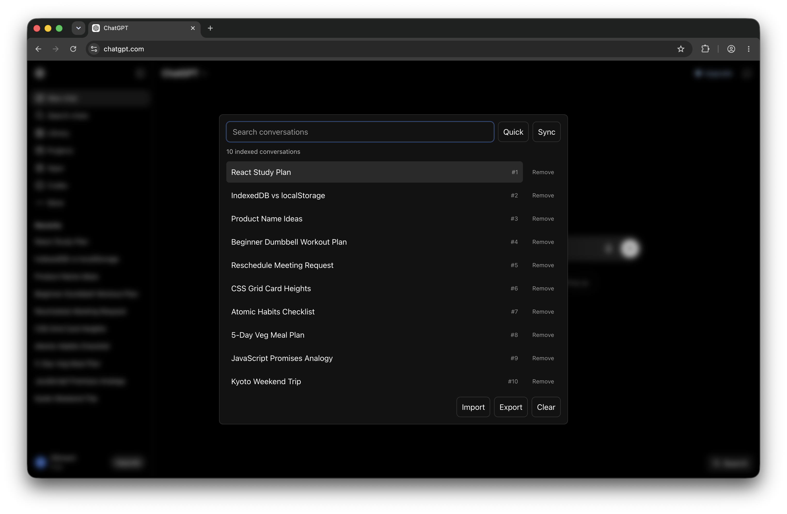

# ChatGPT Conversation Search

Better local search for saved ChatGPT conversations.

<p align="center">
  
</p>

This is an unpacked Chromium extension built as a more reliable replacement for ChatGPT's built-in conversation search. It adds a native-feeling search modal to `chatgpt.com` and indexes conversation titles and links locally in your browser so you can quickly jump back to older conversations.

## Why

ChatGPT's built-in search often does not work reliably for finding past conversations. This extension keeps a local title index so your saved conversations are easier to find when you need them.

## Features

- Search ChatGPT conversation titles with fuzzy matching.
- Open the search modal from the in-page Search button or `Cmd+Shift+.` / `Ctrl+Shift+.`.
- Sync the visible ChatGPT sidebar into a local browser index.
- Quick-sync recent conversations after creating new chats.
- Keep separate indexes for different ChatGPT accounts.
- Import, export, clear, or remove records from the local index.

## Privacy

The extension stores its index in your browser. It does not send your conversation titles, links, or account index to an external service.

## Install From a Release ZIP

1. Download the latest extension ZIP from [GitHub Releases](https://github.com/Vethya/chatgpt-chat-search/releases).
2. Unzip the file.
3. Open `chrome://extensions`.
4. Enable Developer mode.
5. Choose "Load unpacked".
6. Select the unzipped extension folder.
7. Open `https://chatgpt.com/`.
8. Click the extension's Search button or press `Cmd+Shift+.` / `Ctrl+Shift+.`, then run Sync.

## Load From Source

1. Clone this repository.
2. Open `chrome://extensions`.
3. Enable Developer mode.
4. Choose "Load unpacked".
5. Select this repository folder.
6. Open `https://chatgpt.com/`.
7. Click the extension's Search button or press `Cmd+Shift+.` / `Ctrl+Shift+.`, then run Sync.

## Development

Run the test suite and syntax checks:

```sh
npm test
npm run check
```

Create a shareable extension ZIP:

```sh
npm run package
```

The ZIP is written to `dist/` with a dated filename, for example:

```text
dist/chatgpt-conversation-search-2026-06-20-v0.1.0.zip
```
